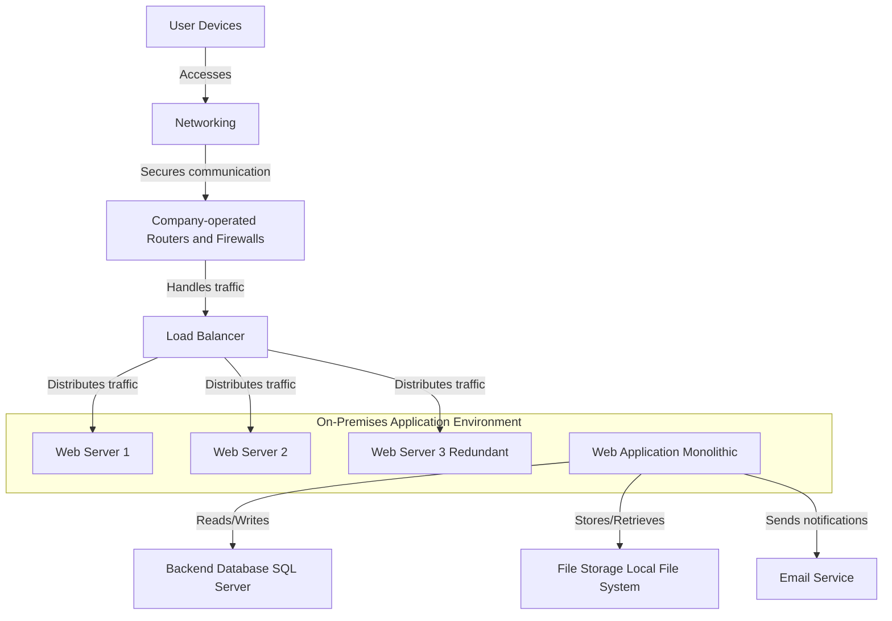

# LAB 3 
## Section 1: On-premise solution design

## Description of the on-premises solution
The diagram illustrates a standard on-premises setup in which user devices connect through firewalls and routers hosted by the business to ensure communication security. After redirecting incoming traffic to a load balancer, requests are automatically split across three web servers, one of which acts as a redundant backup for dependability. These servers house a monolithic web application that stores and retrieves data by interacting with a backend SQL database. While an integrated email service allows users to get notifications, a local file storage system handles file management. This design emphasizes the interdependence of components and the structured traffic flow in providing an integrated on-premises solution.

## Key components that need to be migrated 
The new cloud-based system will be far more scalable, secure, and easy to maintain. Moving the current networking and security setup to a Virtual Private Cloud (VPC) would allow for the secure management of traffic without the need for complicated hardware thanks to Security Groups and firewall services like AWS WAF. An AWS Elastic Load Balancer or other cloud-native solution will be used to replace the load balancer that now regulates traffic to web servers. It will scale on its own to guarantee service availability and handle changes in traffic. The first step in the shift will be moving the application to virtual machines.

## Section 2: Migration Strategies

### 1. Load Balancer
The load balancer The on-premise load balancer that divides traffic across web servers will be covered in the next section. Choosing a cloud-native load balancing solution, such AWS Elastic Load Balancer (ELB) or Azure Load Balancer, should be part of the migration strategy. Configuration requires knowing all of the rules and behavior that the load balancer currently manages in order to dynamically allocate incoming traffic in accordance with actual resource access demands. Testing under a range of traffic situations will validate the best possible performance and smooth recovery.

### 2. Networking and Security
Networking and Security During the cloud migration, a thorough analysis of the existing network settings and security rules will be conducted in order to replicate and enhance them. A Virtual Private Cloud will be part of the setup, and it will be configured appropriately to provide a safe environment for activities. Network Access Control Lists and Security Groups will be used to effectively control traffic flow, which is another aspect of it. In addition, managed firewall services like AWS WAF or Azure Firewall will be used to improve security and satisfy industry standards. To make sure all networking rules and security measures are operating as intended, extensive testing will be done before to going into effect.

### 3. Web Servers
Servers for the Web In this instance, the migration plan for the web servers—physical devices that run applications will include allocating virtual machines; the choice between AWS EC2 and Azure Virtual Machines will be based on the requirements of the applications. Moreover, it might want to think about utilizing Docker to package the application before deploying it on AWS ECS or Azure Kubernetes Service in order to boost efficiency. The process of migration would entail moving application settings and data from on-premise servers to the cloud. Before completing the migration, an overall validation of the application's performance and functionality in the new cloud environment should be conducted.

### 4. Web Application Monolithic
Monolithic Web Applications It is necessary to move the monolithic web application to a managed cloud service, such as Azure App Service or AWS Elastic Beanstalk. In order to create more scalable and maintainable systems, the potential of reworking the application to microservices will be evaluated at this phase. When possible, priority should be placed on beginning refactoring in high-impact areas. It will be essential to guarantee a smooth interface with the new backend database and storage options. The application's performance in the cloud will be thoroughly tested, including load and stress tests.

### SQL Server for the Backend Database
When migrating a backend database like SQL Server, the first step is to choose a suitable managed database provider, such Azure SQL Database or Amazon RDS. Tools like AWS Database Migration Service and Azure Database Migration Service will be used to move data into the new environment securely and effectively. Additionally, to improve performance in the cloud environment, the database settings will be analyzed and adjusted further. Testing would be necessary, of course, to ensure that apps could connect to the new database structure and that data was secure.

### Email Service
The on-premise email solution that was previously utilized to deliver notifications will be moved to a managed provider such as SendGrid or AWS Simple Email solution (SES). This will require configuring the email service with the required parameters, such as DNS settings, domain verification, and application API connections. The conversion procedure will also take into consideration any existing email history or particular preferences. Email functionality will be thoroughly tested, allowing it to demonstrate dependable notification delivery and appropriate application integration.

###  File Storage
Cloud object storage services like AWS S3 and Azure Blob Storage will replace local file storage. Using the appropriate cloud storage migration tools or scripts, the procedure will include moving data while preserving folder structures and permissions. Cloud storage solution permission and access controls should be set up to mimic existing access levels. Application interaction and access to the new storage system will be necessary for following migration verification.